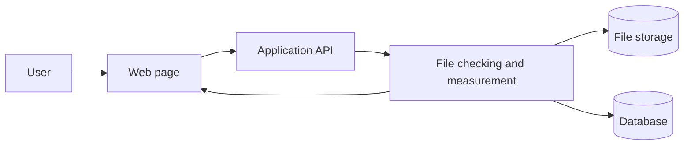
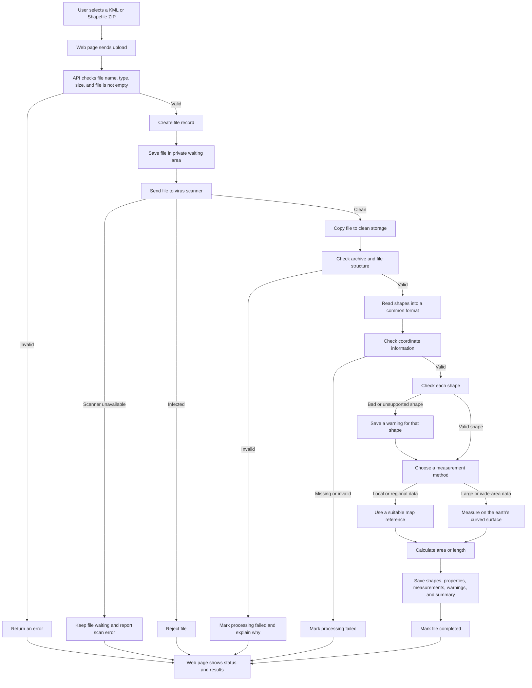

# GeoMeasure

GeoMeasure is a small web application for measuring shapes stored in KML files and Shapefile ZIP files. It reports polygon area in square metres and line length in metres. Points are shown but do not need a measurement.

## How the system works

The application has four simple parts:

1. The web page lets someone choose a KML file or a Shapefile ZIP file.
2. The API receives the file and puts it in a private waiting area.
3. A virus scanner checks the file. Clean files are opened and measured; infected or unsafe files are rejected.
4. The database saves the file information and measurements so the web page can show them later.

The file is never measured directly from latitude and longitude numbers. The application first chooses a suitable map reference or uses the earth's curved surface calculation when the file covers a large area.

### High-level view



This is the short version: the web page talks to the API, the API coordinates file checking and measurement, and the results are saved for the web page to display.

### Detailed upload flow



The project runs as a group of Docker containers: the web page, API, database, file storage, and virus scanner. Their data is kept in Docker volumes so it survives restarts.

## Run it

You need Docker Desktop with the Linux engine enabled. The first setup needs an internet connection and several minutes because the containers and virus-scanner files must be downloaded. Give Docker at least 6 GB of memory.

From the project folder, run:

```powershell
./scripts/init-env.ps1
docker compose up -d --build
docker compose ps
```

When the containers show as running or healthy, open:

- [Web application](http://localhost:5173)
- [API documentation](http://localhost:8000/docs)
- [Health check](http://localhost:8000/health)
- [File storage console](http://localhost:9001)

The storage-console username and password are in the `.env` file created by the setup script. Keep that file private.

## Try an upload

Open the web application and choose `backend/tests/fixtures/valid/survey.kml`. It contains one polygon, one line, and one point. The results page shows the measurements and the method used.

For a Shapefile ZIP, the archive must contain one dataset with matching `.shp`, `.shx`, `.dbf`, and `.prj` files. The `.cpg` file is optional. The application rejects archives with unsafe paths, multiple datasets, missing required files, or excessive contents.

## Stop and start again

```powershell
docker compose stop   # pause the containers and keep data
docker compose up -d  # start them again
docker compose down   # remove containers but keep named data volumes
```

## What happens when a file is uploaded

Every upload starts as untrusted. It is saved privately and scanned before any geospatial reader opens it. If the scanner cannot be reached, the file stays in the waiting area. If malware is found, the file is rejected. If the scan passes, the archive and its shapes are checked before measurements are calculated.

An individual bad or unsupported shape receives a warning while the other valid shapes can still be processed. Missing coordinate information stops a dataset because a physical measurement would not be reliable.

## Main API calls

| Method | Address | What it does |
|---|---|---|
| POST | `/api/files/` | Upload a KML or ZIP file |
| GET | `/api/files/` | List recent uploads |
| GET | `/api/files/{id}/` | Show one file and its summary |
| GET | `/api/files/{id}/measurements/` | Show individual measurements |
| GET | `/health` | Check that the API is alive |

The upload field is named `file`. Results use metres (`m`) and square metres (`m2`).

## Run the checks

```powershell
uv venv .venv
uv pip install --python .venv/Scripts/python.exe -r backend/requirements.lock
uv pip install --python .venv/Scripts/python.exe --no-deps -e backend
cd backend
../.venv/Scripts/python.exe -m pytest -q
cd ..
```

To check the running Docker services with real KML, Shapefile, archive, and antivirus examples:

```powershell
.venv/Scripts/python.exe scripts/smoke_test.py
```

The smoke test uses the harmless EICAR antivirus test marker. It is only for the local test stack and should not be pointed at a shared system.

## Project notes

The full design is documented in [architecture.md](architecture.md). Authentication, maps, background workers, and advanced spatial searches are intentionally outside this first version. The current version is intended for local use and learning; add login, HTTPS, and access controls before putting it on a public server.
